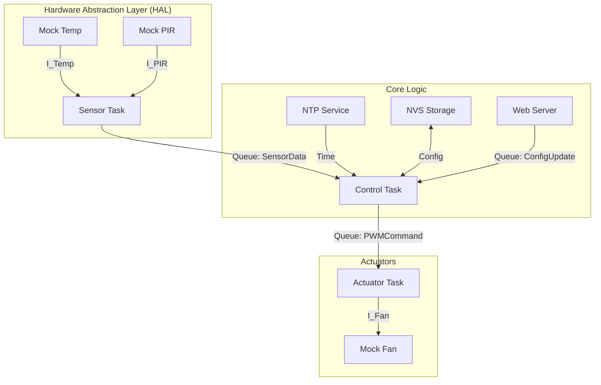

# 🌬️ Smart Crib Ventilation System (ESP32)

Sistema de ventilación inteligente modular para cunas, basado en ESP32 y ESP-IDF. El sistema controla un ventilador PWM basándose en temperatura y presencia, permitiendo modos manuales, automáticos y programados por horario.

## 🚀 Estado Actual (Fase 2 - Simulación Conectada)
El sistema es funcional a nivel de software. No requiere hardware externo todavía.
- **Arquitectura:** Completamente modular (HAL, Core, Drivers).
- **Sensores:** Simulados mediante "Mocks" (generan datos aleatorios).
- **Conectividad:** WiFi STA + NTP (Sincronización horaria automática).
- **Persistencia:** Guardado de configuración en NVS Flash.

## 🏗️ Arquitectura del Sistema

El software sigue un patrón de capas concéntricas con comunicación asíncrona por colas FreeRTOS.



## 🔌 Guía de Integración de Hardware (Para el futuro)

Actualmente, el sistema usa `mocks` en `main/mocks/`. Para conectar sensores reales, **NO modifique la lógica del núcleo (`tasks/`)**.

### Pasos para migrar a Hardware Real:

1.  **Sensor de Temperatura (ej. DHT11/DS18B20):**
    *   Crear driver en `main/drivers/dht_driver.c`.
    *   Implementar la interfaz `temp_sensor_interface_t` definida en `hal_interfaces.h`.
    *   En `task_sensor.c`, cambiar la inyección de dependencia:
        ```c
        // Antes
        extern const temp_sensor_interface_t temp_mock_impl;
        // Después
        extern const temp_sensor_interface_t dht_driver_impl;
        ```

2.  **Sensor PIR (Presencia):**
    *   Conectar salida digital del PIR a un GPIO (ej. GPIO 14).
    *   Implementar `pir_sensor_interface_t` leyendo el GPIO.

3.  **Ventilador (PWM):**
    *   Usar el periférico LEDC del ESP32.
    *   Implementar `fan_interface_t` configurando frecuencia (25kHz) y resolución.

### Pinout Propuesto (Sujeto a cambios)
| Componente | Pin ESP32 | Notas |
|------------|-----------|-------|
| PWM Fan    | GPIO 18   | Base de transistor MOSFET |
| Sensor Temp| GPIO 4    | Data (DHT22) |
| PIR Sensor | GPIO 14   | Input Digital |

## 🛠️ Configuración y Compilación

### Requisitos
- ESP-IDF v5.x
- Visual Studio Code con Extensión Espressif

### Configurar WiFi
1. Abrir `main/network/wifi_station.c`.
2. Editar las macros `WIFI_SSID` y `WIFI_PASS`.

### Compilar y Ejecutar
```bash
idf.py build
idf.py -p COMx flash monitor
```

## 🗺️ Roadmap
- [x] Arquitectura de Tareas y Colas
- [x] Mocks de Sensores
- [x] Almacenamiento NVS
- [x] Sincronización NTP
- [x] Sincronización NTP y Motor de Horarios.
- [ ] Servidor Web (Rest API) para configuración
- [ ] Integración Hardware Real
- [ ] Actualizaciones OTA (Over-The-Air).