# 🌬️ Sistema de Ventilación Inteligente para Cuna (IoT)

Sistema de control ambiental inteligente basado en **ESP32**, diseñado para regular la ventilación automáticamente mediante:
* **Monitoreo de temperatura.**
* **Detección de presencia.**
* **Programación horaria.**

El proyecto utiliza **FreeRTOS** para la gestión de tareas en tiempo real y ofrece una interfaz web completa para el control y monitoreo remoto.


---

## 🛠️ Descripción del Hardware

El sistema está implementado como un prototipo híbrido funcional que integra diversos componentes para la adquisición de datos y la actuación.

### Componentes Utilizados

| Componente | Especificación | Función y Configuración |
| :--- | :--- | :--- |
| **Microcontrolador** | ESP32-DevKitC V1 | SoC **Xtensa® Dual-Core 32-bit LX6** (Plataforma principal). |
| **Sensor de Temperatura** | **Termistor NTC 47D-15** | Sensor adaptado (Originalmente limitador de corriente) con calibración por software. Configurado en un divisor de tensión con resistencia serie de **$100\Omega$**. |
| **Sensor de Presencia** | **PIR HW-416-B (HC-SR501)** | Sensor infrarrojo pasivo utilizado para la detección de movimiento. |
| **Actuador** | **LED Azul Integrado (GPIO 2)** | Simula la función del ventilador. Controlado por señal **PWM (LEDC)** para variar el brillo y representar la velocidad del motor. |

---

## 📐 Diagrama de Bloques del Hardware

El siguiente diagrama muestra el flujo de datos y la interconexión lógica de los componentes.

```mermaid
graph TD
    PS[Fuente de Alimentación USB 5V] -->|5V| ESP[ESP32 DevKit V1]
    PS -->|5V| PIR[Sensor PIR HW-416-B]
    
    subgraph Sensores
    PIR -->|Señal Digital| ESP
    NTC[NTC 47D-15] -->|Señal Analógica| ESP
    end
    
    subgraph Actuadores
    ESP -->|PWM Signal| LED[LED Azul / Ventilador]
    end
    
    ESP <-->|WiFi 2.4GHz| ROUTER[Router WiFi]
    ROUTER <-->|HTTP| CLIENT[Cliente Web PC/Móvil]
```



## 🏗️ Arquitectura del Sistema

El software sigue un patrón de capas concéntricas con comunicación asíncrona por colas FreeRTOS.


## 🔌 Guía de Integración de Hardware (Para el futuro)

Actualmente, el sistema usa `mocks` en `main/mocks/`. Para conectar sensores reales, **NO modifique la lógica del núcleo (`tasks/`)**.

### Pasos para migrar a Hardware Real:

1.  **Sensor de Temperatura (ej. DHT11/DS18B20):**
    *   Crear driver en `main/drivers/dht_driver.c`.
    *   Implementar la interfaz `temp_sensor_interface_t` definida en `hal_interfaces.h`.
    *   En `task_sensor.c`, cambiar la inyección de dependencia:
        ```c
        // Antes
        extern const temp_sensor_interface_t temp_mock_impl;
        // Después
        extern const temp_sensor_interface_t dht_driver_impl;
        ```

2.  **Sensor PIR (Presencia):**
    *   Conectar salida digital del PIR a un GPIO (ej. GPIO 14).
    *   Implementar `pir_sensor_interface_t` leyendo el GPIO.

3.  **Ventilador (PWM):**
    *   Usar el periférico LEDC del ESP32.
    *   Implementar `fan_interface_t` configurando frecuencia (25kHz) y resolución.

### Pinout Propuesto (Sujeto a cambios)
| Componente | Pin ESP32 | Notas |
|------------|-----------|-------|
| PWM Fan    | GPIO 18   | Base de transistor MOSFET |
| Sensor Temp| GPIO 4    | Data (DHT22) |
| PIR Sensor | GPIO 14   | Input Digital |

## 🛠️ Configuración y Compilación

### Requisitos
- ESP-IDF v5.x
- Visual Studio Code con Extensión Espressif

### Configurar WiFi
1. Abrir `main/network/wifi_station.c`.
2. Editar las macros `WIFI_SSID` y `WIFI_PASS`.

### Compilar y Ejecutar
```bash
idf.py build
idf.py -p COMx flash monitor
```

## 🗺️ Roadmap
- [x] Arquitectura de Tareas y Colas
- [x] Mocks de Sensores
- [x] Almacenamiento NVS
- [x] Sincronización NTP
- [x] Sincronización NTP y Motor de Horarios.
- [ ] Servidor Web (Rest API) para configuración
- [ ] Integración Hardware Real
- [ ] Actualizaciones OTA (Over-The-Air).


# 🔌 Diagrama de Conexiones (Pinout)

A continuación, se detalla el esquema de conexión física de los componentes en la protoboard con el módulo **ESP32**:

| Componente | Pin Componente | Pin ESP32 | Función | Notas |
| :--- | :--- | :--- | :--- | :--- |
| **Sensor PIR** | VCC (+) | **VIN** | 5V | Alimentación directa del USB. |
| | GND (-) | **GND** | Tierra | Referencia común. |
| | OUT (Señal) | **GPIO 27** | Input | Lectura digital (0/1). |
| **Termistor NTC** | Pin A | **3.3V** | 3.3V | A través de una resistencia de $100\Omega$. |
| | Pin B | **GND** | Tierra | Referencia común. |
| | Nodo Central | **GPIO 34** | ADC1\_6 | Punto medio del divisor de tensión. |
| **LED/Fan** | Ánodo (+) | **GPIO 2** | LEDC | Controla el LED integrado en la placa (D2). |

---

### 📝 Nota sobre el Circuito del NTC

Se implementó un circuito divisor de voltaje para la lectura del termistor NTC.

La conexión es la siguiente:

$$3.3V \quad \longleftrightarrow \quad \text{Resistencia } 100\Omega \quad \longleftrightarrow \quad [\text{NODO A (GPIO 34)}] \quad \longleftrightarrow \quad \text{NTC 47D} \quad \longleftrightarrow \quad GND$$

---


# 💾 Diagrama de Bloques del Firmware

El firmware sigue una arquitectura modular basada en el patrón **Productor-Consumidor** y FreeRTOS para la concurrencia.

```mermaid
graph TD
    subgraph "Capa de Aplicación (Tasks)"
        TS[Sensor Task] 
        TC[Control Task]
        TW[Web Server Task]
    end

    subgraph "Capa de Abstracción (HAL)"
        ADC[ADC Driver]
        GPIO[GPIO Driver]
        PWM[LEDC PWM Driver]
    end

    subgraph "Servicios del Sistema"
        NVS[NVS Storage]
        WIFI[WiFi Station]
        NTP[SNTP Time Sync]
    end

    %% Relaciones
    ADC -->|Raw Data| TS
    GPIO -->|Digital Data| TS
    TS -->|Queue: SensorData| TC
    TC -->|Logica PID/On-Off| PWM
    TC <-->|Config Struct| NVS
    NTP -->|Hora Actual| TC
    TC <-->|Shared State| TW
    TW <-->|JSON/HTML| WIFI


```



